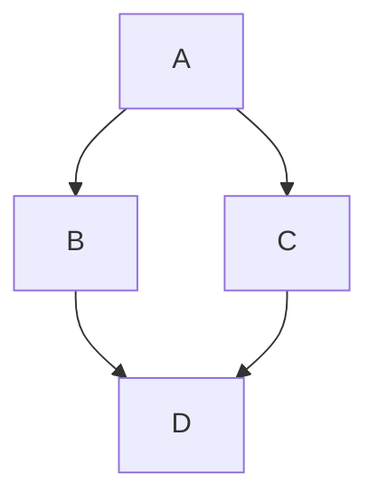

[//]: # (This is sample page #1 REPLACE_ME: Replace or remove according to your needs)
### Paragraph #1 


````markdown

````

```html
<div class="mermaid">
graph TD;
    A-->B;
    A-->C;
    B-->D;
    C-->D;
</div>
```
